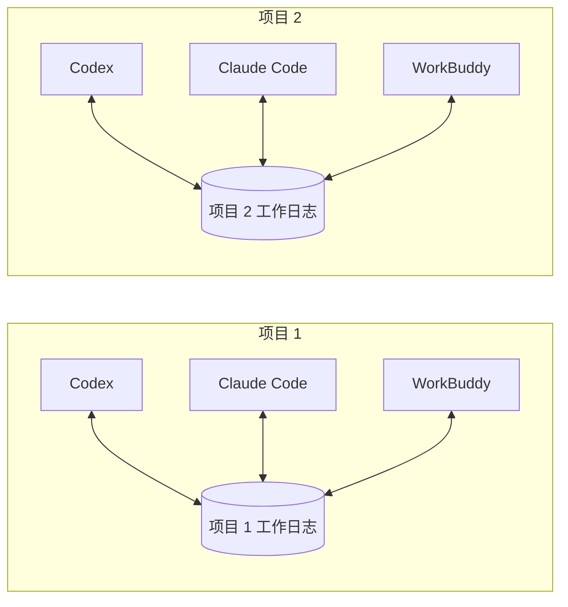

# AgentBridge · 项目内共享进展

让同一台 Mac 上的 Codex、Claude Code、WorkBuddy 了解彼此在**同一个项目**做过什么。每个项目独立存储；项目 1 的进展不会作为项目 2 的上下文提供。

**默认：自动记录、手动同步。** 平时只记在本地；你在需要衔接工作的助手中单独发送 **“同步进展”**，才把其他助手的新进展读入当前会话。

这是可运行的本地工具，Python 3.9+，只使用标准库，无额外 API Key、第三方服务或常驻后台进程。已在本机 CSCI642 项目确认 WorkBuddy 的实际记录；三个客户端的完整聊天往返仍需在客户端验收。

**正式交接使用显式 `handoff` skill。** Codex 输入 `$handoff send` / `$handoff receive`；Claude Code、WorkBuddy 输入 `/handoff send` / `/handoff receive`。先从客户端实际识别出的 skill 入口选择 `handoff`。不把裸写 `handoff send` 当作已加载工具的证据。详见 [交接 skill 使用说明](docs/handoff-skills.md)。

个人 skill 在每个客户端安装一次即可，无需在每个项目重复安装。交接的边界就是当前工作目录（`--cwd`）本身：只在该目录内共享，不向上并入父目录。首次在某个工作区调用 `handoff` 时自动建立边界（写入该目录的 `.agentbridge/`），无需手动登记；`established: true` 时 skill 会明确告知你新建了边界。手动 `init` 仅在你还想开启普通进度记录 hooks 时才需要（可选）。

### 一步安装（可交给 agent 执行）

在本仓库目录运行下面这一条即可。它会**自动探测本机装了哪几个客户端**（`~/.codex`、`~/.claude`、`~/.workbuddy-ai`），只给存在的客户端安装，并逐个校验写入结果；有同名冲突或写入失败会非零退出并报出真实原因，不会假装成功：

```bash
python3 install.py
```

从 GitHub 拉取后首次安装（免打包，直接用克隆目录）：

```bash
git clone https://github.com/wjh7000/AgentBridge.git agentbridge && cd agentbridge && python3 install.py
```

或作为标准 Python 包安装（推荐给不想留着克隆目录的场景，需 Python 3.9+）：

```bash
pipx install git+https://github.com/wjh7000/AgentBridge.git   # 或 pip install git+…
agentbridge-install               # 自动探测客户端并安装 handoff skill
```

打包安装后有两个命令：`agentbridge`（后端 CLI）与 `agentbridge-install`（一步安装器，等价于 `install.py`）。写入 skill 的 `bridge.json` 会指向已安装的 `agentbridge` 控制台脚本的绝对路径，因此**即使克隆目录删除、或以后从别的工作目录调用也仍然有效**。

其他用法：`--preview` 只预览不写入；`--clients codex,claude` 指定子集；`--all` 连尚未出现的客户端目录也一并安装（`python3 install.py ...` 与 `agentbridge-install ...` 参数一致）。更底层的 `python3 agentbridge.py install-skills` / `agentbridge install-skills` 默认三个客户端、不做探测。

> 交给 agent 时可直接说：「在本仓库目录运行 `python3 install.py`，把输出原样贴回来。」安装本身不改动任何项目、不联网、不调用模型，只在各客户端个人目录写入 skill。

安装后刷新或重启客户端，从原生技能菜单选择 `handoff`。skill 会先校验本地后端、项目、数据库及协议版本。发送成功必须取得真实的交接编号；接收只在你调用时发生。配置缺失或执行失败时停止，不用一段临时文字冒充交接。

## 日常体验

1. Claude Code 在项目 1 修改登录功能，结束回复后自动记录一份进展。
2. 你切到项目 1 的 Codex，需要衔接时单独发送“同步进展”；钩子把 Claude 的简短增量加入这次消息的上下文。
3. Codex 继续工作，结束后也留下报告。WorkBuddy 通过同样的机制读取、记录。
4. 项目 2 的三个助手只读取项目 2 的日志。



记录过程无需操作，写入发生在文件操作/本轮结束时。读取由你决定；普通消息不会注入共享进展。它不会强行唤醒或打断另一个助手，也不会自动解决两个助手同时修改文件产生的冲突。

## Token 开销

- 本地记录、筛选、截短报告都不调用模型，不为此额外消耗模型 token。
- 默认只安装 hooks，不添加项目规则或 MCP 工具描述。普通消息不注入共享正文；客户端自身可能仍有少量钩子状态开销。
- 手动同步只读重要增量，忽略文件操作噪声；每条报告摘要最多约 220 字符，总正文最多 1,000 字符。新会话只看每个其他客户端的最近一条报告。
- 同一会话重复同步不会再发送旧报告；没有新内容时只反馈一句提示。
- 手动同步本轮的确认/复述不会被 Stop 再次发布，避免助手来回转述造成假进展；下一条普通工作指令会恢复记录。
- 1,000 **字符**不是 1,000 token。具体 token 取决于文本和模型；注入后的内容仍可能在后续输入上下文中计入用量，因此不能承诺同步后的后续轮次完全没有开销。
- 不另开模型生成摘要；本地截短可能省略细节，需要时再查看本地完整报告。
- 正式交接则由来源会话的模型整理一次结构化内容，生成与接收都会消耗宿主 token；本地保存不另开模型。默认先读最多 1,000 字符的任务卡，详情按需读取；省略了约束或阻塞时必须补读。不会后台定时总结。

可选模式：`manual`（默认，只在“同步进展”时读入）、`session`（会话开始时读入）、`interval`（有新报告且同一接收会话距离上次注入至少 15 分钟）。后两种也接受手动“同步进展”。例如：

```bash
python3 agentbridge.py init --project "/绝对路径/项目1" --mode manual
```

重复 `init` 不指定 `--mode` 时保留已有选择。检测频率不等于模型调用频率：钩子的本地检查本身不调用模型。

## 一次接入

以下进度记录 hooks 是**可选**功能（交接 skill 不依赖它）。下面用克隆目录的写法 `python3 agentbridge.py …`；若你是 `pipx/pip` 安装的，把它换成 `agentbridge …` 即可，命令与参数一致。

克隆用法下先把此工具放在固定目录，命令在本工具目录执行；`/绝对路径/项目1` 和 `项目2` 需替换为现有真实目录。此时工具路径被写进钩子配置，移动克隆目录后要重新接入。**用 `pipx/pip` 安装时钩子指向已安装的 `agentbridge` 命令，不受克隆目录移动影响。**

```bash
python3 agentbridge.py init --project "/绝对路径/项目1" --preview
python3 agentbridge.py init --project "/绝对路径/项目1"
python3 agentbridge.py init --project "/绝对路径/项目2"
```

`init` 保留已有配置，在项目中添加 Codex、Claude 的钩子，以及 `.agentbridge/` 注册信息。默认处理三个客户端；只用其中两个时，加 `--clients codex,claude`。`--preview` 只列出将修改的文件，不写入。需要模型按需搜索完整历史时，可显式加 `--with-mcp` 安装额外工具与简短规则；默认不开启，以节约上下文。此选项添加的配置不会因以后省略该选项而自动删除。

WorkBuddy AI 5.5.2 桌面版只加载用户级钩子，需要再配置一次统一入口：

```bash
python3 agentbridge.py enable-workbuddy \
  --project "/绝对路径/项目1" \
  --project "/绝对路径/项目2" --preview

python3 agentbridge.py enable-workbuddy \
  --project "/绝对路径/项目1" \
  --project "/绝对路径/项目2"
```

这一步合并用户级 WorkBuddy hooks，备份原配置，并登记允许共享的项目。之后新增项目时先 `init`，再对新项目运行 `enable-workbuddy`；已登记项目会保留。全局入口只负责按当前工作目录选择项目，不保存各项目的工作内容。

重启或新建客户端会话，完成原生的项目/MCP/钩子信任流程。Codex CLI 用 `/hooks` 查看并信任钩子，用 `/mcp` 查看服务。无需设置跳过审批或全盘访问。首次信任不能由本工具代替；钩子没被加载或未获信任时，不会有自动共享。[Codex hooks 文档](https://learn.chatgpt.com/docs/hooks)、[Claude hooks 文档](https://code.claude.com/docs/en/hooks)。

WorkBuddy 的记录与手动同步只需 hooks。加 `--with-mcp` 后生成的 `.agentbridge/setup/workbuddy-mcp.json` 是可选连接器配置，需在 WorkBuddy 界面按项目单独接入，用于主动搜索/报告；不要把它覆盖到 Claude 的 `.mcp.json`。其 MCP 子进程必须以所属项目或其子目录为工作目录，否则服务会拒绝启动。

## 怎么确认接通

让项目 1 的 Claude Code 完成一条简短任务，然后查看：

```bash
python3 agentbridge.py status --project "/绝对路径/项目1"
python3 agentbridge.py context --project "/绝对路径/项目1" --agent codex
```

再向项目 1 的 Codex 单独发送“同步进展”。向项目 2 的 Codex 发送相同消息时，不应出现项目 1 的内容。按相同流程检查 WorkBuddy 的接收与写入。普通消息不应注入，连续两次“同步进展”也不应重复返回同一报告。`status` 展示已存报告，不能单凭它断言客户端在线或钩子已获信任。

只想验证本地工具、暂不接入真实客户端：

```bash
python3 -m unittest discover -s tests -v
python3 scripts/demo.py
```

演示仅在临时目录创建模拟项目，不修改客户端设置。测试覆盖手动触发、按会话去重、项目隔离、同步回声抑制、并发写入、stdio 协议、配置恢复和正式交接的失败处理。

## 共享什么

| 内容 | 行为 |
| --- | --- |
| 本轮结束回复 | 自动记录为最多 4,000 字符的助手自述；超长截断，并非额外模型生成的语义摘要 |
| 明确的文件编辑 | 记录项目内文件路径，不记录代码内容；Shell 内的编辑不保证被识别 |
| 决定、阻塞、验证结果 | 从结束回复获取；也可调用 MCP `report_progress` 主动记录 |
| 手动同步 | 只注入其他客户端新出现的重要报告，最多 3 条，总计最多 1,000 字符；新会话每个其他客户端最多 1 条 |
| 详细历史 | CLI `context` 或可选 MCP `get_context` 按需查询，最多 12 条、6,000 字符 |
| 完整聊天、用户提示、终端输出 | 不采集，不扫描历史会话 |

使用 MCP 的三个工具：`get_context`、`report_progress`、`search_progress`。作者与项目在服务启动时固定，工具调用不能指定另一个项目。stdio 实现覆盖 MCP 2024-11-05 至 2025-11-25 握手版本和这些工具；未实现整个 MCP 协议或新的无握手版本。[MCP 生命周期规范](https://modelcontextprotocol.io/specification/2025-11-25/basic/lifecycle)。

## 项目边界与数据

- 数据在 `<project>/.agentbridge/memory.sqlite3`，并用规范化绝对路径的哈希作为查询命名空间。不同目录即使同名，也不共享；同一目录的符号链接别名视为同一项目。
- 进度记录 hooks / MCP：子目录归属所在项目；遇到嵌套项目的注册标记就停止继承。WorkBuddy 只路由已明确登记的项目。交接 skill 则不同——它的边界就是当前工作目录本身，首次调用自动建立，不向上归并。
- MCP 校验启动目录、hooks 校验事件 `cwd`。复制项目连同旧配置后，必须在新目录重新 `init`；旧配置不能读出原项目内容。移动项目默认开启新命名空间，旧记录不自动迁移。
- 同一仓库的不同 clone/worktree 默认独立，暂未实现跨目录绑定为同一逻辑项目。数据库拷贝后旧数据仍物理存在，但本工具的查询不会返回它；不要把数据库文件当作分享给他人的导出格式。
- SQLite WAL 支持多个助手同时写入；回调按事件标识去重。进展不是文件锁，也不是经过验证的事实。优先核对真实代码和测试。
- 本工具不主动联网；内容注入助手后，会进入该客户端正常的模型上下文。数据库目录权限 `700`、数据库 `600`；常见 token/密码/私钥格式尽力过滤，并非完整的数据防泄漏系统。
- 共享报告始终被标记为外部、未验证数据，不能当作指令或授权。项目隔离用于避免路由错误；它不是阻止同一系统用户或已有文件访问权限的助手读取其他目录的系统级沙箱。
- 自动 hooks 出错时返回空结果，不阻断工作。客户端可能显示 hook 执行状态；本工具不保证界面完全没有提示。

## 关闭与恢复

```bash
python3 agentbridge.py disable-workbuddy
python3 agentbridge.py uninstall-skills
python3 agentbridge.py uninstall --project "/绝对路径/项目1"
python3 agentbridge.py uninstall --project "/绝对路径/项目2"
```

卸载恢复未被你修改过的配置。安装后有手动改动的文件会保留，并在结果中列为跳过，避免误删你的权限、规则或其他钩子。重复安装也不会把你的新改动纳入旧文件恢复。共享数据库会保留；确认不用后，可在客户端停止使用时删除对应 `.agentbridge/` 目录。

实现与兼容性证据见 [docs/compatibility.md](docs/compatibility.md)。产品版本升级后，尤其 WorkBuddy 桌面的内部启动方式改变时，应重做一次真实会话联调。
